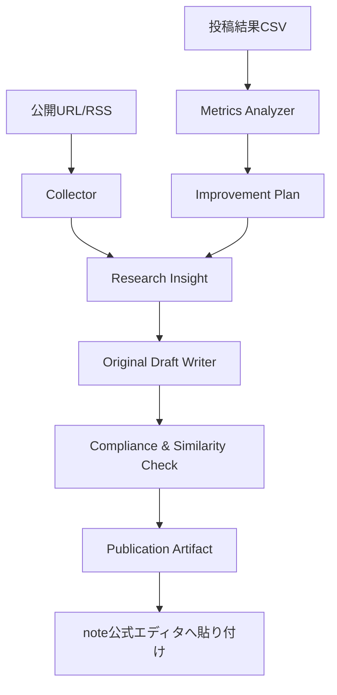
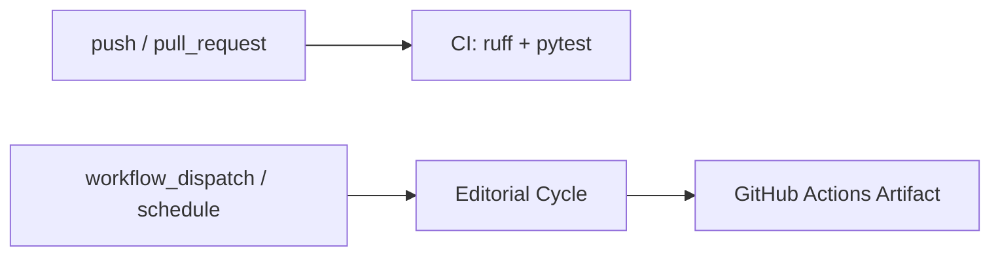

# Architecture

## 全体像

このリポジトリは、note.com向けの編集サイクルをGitHub Actions上で回すための自動化基盤です。

## コンポーネント

- Collector: 公開URLとRSSを取得します。note.comの `/api/*` のような非公式APIらしきパスはブロックします。
- Analyzer: ソース本文から頻出語、読者ニーズ、買われやすい記事構造を抽出します。
- Writer: 調査結果をもとに、独自構成の記事Markdownを生成します。禁止表現、過度な収益保証、ソースとの類似度をチェックします。
- Publisher: 投稿用Markdown、チェックリスト、メタデータ、manifestを `outputs/outbox/` に出力します。noteへの直接投稿は、公式公開APIがないため実装していません。
- Metrics Analyzer: 投稿後CSVを読み、表示数、スキ、コメント、販売数から改善案を生成します。

## CI/CD

## Secrets

現時点で必須のSecretsはありません。将来、公式APIを持つ外部CMSや分析サービスへ接続する場合のみ、次のようなSecretsを追加します。

- `OPENAI_API_KEY`: LLM生成を外部API化する場合
- `CMS_API_TOKEN`: 公式APIを持つCMSへ投稿する場合
- `ANALYTICS_API_TOKEN`: 公式分析APIを使う場合

noteログインID、パスワード、CookieをSecretsへ入れる運用は推奨しません。
